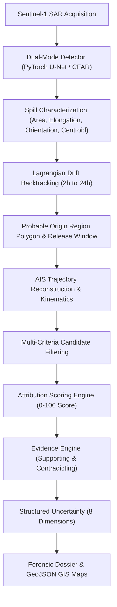

# MARS — Maritime Intelligence & Forensic Investigation Platform

[](https://sih.gov.in)
[](https://fastapi.tiangolo.com)
[](https://pytorch.org)
[](https://postgis.net)
[](LICENSE)
[]()

> **SIH Problem Statement SIH26143**: Oil Spill Detection & Vessel Attribution.  
> Production-structured, hackathon-feasible backend for investigating potential marine oil spills and attributing candidate source vessels using spatial, temporal, physical drift, and AIS evidence.

---

## 1. Executive Summary & Forensic Neutrality

MARS is an objective decision-support platform designed for maritime law enforcement, coast guards, and environmental protection authorities. It implements the complete 7-stage analytical pipeline:

$$\text{Detect} \longrightarrow \text{Characterize} \longrightarrow \text{Reconstruct} \longrightarrow \text{Trace Back} \longrightarrow \text{Identify} \longrightarrow \text{Rank} \longrightarrow \text{Explain}$$

### Strict Scientific Neutrality & Non-Certainty Standard
The platform operates under rigorous evidentiary and legal standards:
- **Never Claims Guilt or Certainty**: The system computes an **Attribution Score** ($0\text{--}100$) representing multi-criteria evidentiary compatibility. It never outputs "guilty vessel" or "probability of guilt".
- **Terminology**: Uses *potential oil spill*, *candidate vessel*, *most likely source*, *supporting evidence*, *contradicting evidence*, and *structured uncertainty*.
- **Neutral Interpretation of Telemetry**: AIS reception gaps are logged as **Data Quality Indicators**, never automatically presumed to be intentional or illegal behavior.

---

## 2. Region-Agnostic Architecture

MARS is completely **region-agnostic**. It operates across any bounding box (AOI) in the Indian maritime domain:
- Arabian Sea & West Coast Corridor
- Bay of Bengal & East India Coastal Current (EICC)
- Andaman Sea & Six Degree Channel (Malacca Chokepoint)
- Lakshadweep Sea, Gulf of Kutch, Gulf of Khambhat, Gulf of Mannar, Palk Bay

Incidents and scenarios are managed strictly as **data** (JSON schemas and spatial coordinates), never hardcoded application logic.

---

## 3. Data Modes & Provider Architecture

| Data Mode | Satellite (SAR) | Ocean & Atmospheric Environment | AIS Vessel Tracking | Purpose |
| :--- | :--- | :--- | :--- | :--- |
| **`MODE A: DEMONSTRATION`** | Deterministic synthetic SAR raster | Spatially varying current/wind fields | Curated tanker & cargo tracks | 100% offline, guaranteed SIH demo |
| **`MODE B: REAL_API`** | Copernicus CDSE (Sentinel-1) | Copernicus Marine (CMEMS) | Global Fishing Watch API | Live real-world ingestion |
| **`MODE C: HYBRID`** *(Recommended)* | Real Sentinel-1 SAR | Real Copernicus Marine currents/winds | Curated deterministic AIS tracks | Real physics + deterministic demo safety |

---

## 4. Analytical Engines



### Lagrangian Particle Drift Physics
$$\frac{d\mathbf{x}_i}{dt} = \vec{u}_{\text{current}} + \alpha_{\text{wind}} \cdot \vec{u}_{\text{wind}} + \vec{u}_{\text{diffusion}}$$
- **Adjoint Backtracking**: Traces 500 particles backwards ($2\text{h}, 4\text{h}, 6\text{h}, 8\text{h}, 12\text{h}, 18\text{h}, 24\text{h}$) to form the Probable Origin Region polygon.
- **Forward Forecast**: Predicts slick propagation ($+6\text{h}, +12\text{h}, +24\text{h}$) and calculates coastal proximity warnings.

### Explainable Attribution Scoring ($0\text{--}100$)
Weighted composite screening index based on 8 configurable factors:
- Origin Polygon Intersection ($0.25$)
- Temporal Window Alignment ($0.20$)
- Drift Compatibility ($0.20$)
- Trajectory Consistency ($0.15$)
- Vessel Type & Tonnage ($0.05$)
- AIS Data Quality ($0.05$)
- Kinematic Alterations ($0.05$)
- Sensor Quality ($0.05$)

---

## 5. Quick Start Guide

### Option 1: Run Locally with Python (Zero-Dependency SQLite Mode)

```powershell
# 1. Clone repository
cd e:\mars-int

# 2. Install dependencies
python -m pip install -r backend/requirements.txt

# 3. Verify test suite (14 tests)
python -m pytest tests -v

# 4. Start backend server
python -m uvicorn backend.app.main:app --host 127.0.0.1 --port 8000 --reload
```

Open your browser at **`http://127.0.0.1:8000/docs`** to view interactive Swagger documentation.

---

### Option 2: Run with Docker Compose (PostgreSQL + PostGIS Mode)

```powershell
docker compose up --build
```
This launches:
- PostGIS database container on port `5432`
- MARS backend FastAPI container on port `8000`

---

## 6. Testing the End-to-End Demo via API

### Step 1: Inspect System Capabilities & Health
```bash
curl -X GET http://127.0.0.1:8000/api/v1/system/capabilities
```

### Step 2: Seed Generic Demonstration Scenarios
```bash
curl -X POST http://127.0.0.1:8000/api/v1/demo/seed
```
*Seeds Arabian Sea, Bay of Bengal, Andaman Sea, and Ennore historical scenarios.*

### Step 3: List Available Investigations
```bash
curl -X GET http://127.0.0.1:8000/api/v1/investigations
```

### Step 4: Execute the 21-Step Forensic Investigation Pipeline
```bash
curl -X POST http://127.0.0.1:8000/api/v1/investigations/<INVESTIGATION_ID>/run
```

### Step 5: Inspect Candidate Ranking & Attribution Scores
```bash
curl -X GET http://127.0.0.1:8000/api/v1/attribution/investigations/<INVESTIGATION_ID>
```

### Step 6: Render Combined GIS GeoJSON Map
```bash
curl -X GET http://127.0.0.1:8000/api/v1/investigations/<INVESTIGATION_ID>/map
```
*Returns GeoJSON layers: potential slick polygon, centroid, probable origin region, backward particles, forward forecast, vessel tracks, and candidate markers.*

### Step 7: Export Comprehensive Forensic Investigation Report
```bash
curl -X GET http://127.0.0.1:8000/api/v1/investigations/<INVESTIGATION_ID>/report
```

---

## 7. Environment Variables (`.env`)

```ini
APP_ENV=development
DEBUG=true
DATA_MODE=DEMONSTRATION   # DEMONSTRATION | REAL_API | HYBRID
DATABASE_URL=sqlite:///./data/mars_local.db

# Optional Copernicus CDSE Credentials
COPERNICUS_CLIENT_ID=
COPERNICUS_CLIENT_SECRET=

# Optional Copernicus Marine Credentials
COPERNICUS_MARINE_USERNAME=
COPERNICUS_MARINE_PASSWORD=

# Optional Global Fishing Watch Token
GFW_API_TOKEN=
```

---

## 8. Repository Structure

```
MARS/
├── backend/
│   ├── app/
│   │   ├── main.py                  # FastAPI Application Entrypoint
│   │   ├── api/                     # REST API Routers
│   │   ├── core/                    # Config, Database, Exceptions, Logging
│   │   ├── models/                  # SQLAlchemy 2.0 PostGIS/SQLite Models
│   │   ├── schemas/                 # Pydantic v2 Schemas
│   │   ├── engines/                 # Drift, Attribution, Evidence, Uncertainty, Detector
│   │   ├── providers/               # Base, Demo, Copernicus, Marine, AIS
│   │   └── services/                # Pipeline Orchestrator, GIS, Reports, Demo
│   ├── alembic/                     # Database Migrations
│   ├── requirements.txt
│   └── Dockerfile
├── ml/
│   ├── models/                      # PyTorch U-Net & Classifier
│   ├── preprocessing/               # SAR Decibel Normalization & Speckle Filters
│   ├── inference/                   # ML Checkpoint Inference Service
│   └── evaluation/                  # IoU, Dice, Forensic Error Metrics
├── data/demo/                       # Generic Demonstration Scenarios
│   ├── arabian_sea/
│   ├── bay_of_bengal/
│   ├── andaman_sea/
│   └── ennore_optional/
├── docs/                            # Documentation
│   ├── ML_DATASET_REQUIREMENTS.md
│   ├── DATA_SOURCES.md
│   ├── API_PROVIDERS.md
│   ├── ARCHITECTURE.md
│   └── IMPLEMENTATION_STATUS.md
├── tests/                           # Pytest Automated Test Suite
├── docker-compose.yml
├── .env.example
└── README.md
```

---

## 9. Scientific Limitations & Legal Notice

1. **Screening Tool Only**: Attribution scores represent forensic consistency and spatial-temporal overlap. They do not constitute judicial evidence of fault or legal liability.
2. **AIS Data Quality**: AIS reception gaps are data quality indicators and must not be cited as proof of intentional spoofing or evasion without terrestrial sensor corroboration.
3. **Physical Verification**: Any operational attribution must be verified by maritime authorities via on-site vessel boarding, oil fingerprinting (GC-MS analysis), and cargo log inspection.
