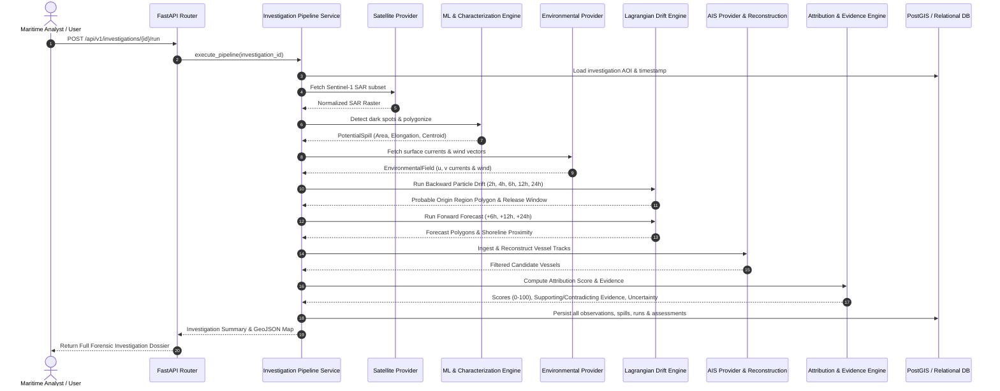

# MARS Architecture & Analytical Engineering Specification

**Project**: MARS — Maritime Intelligence & Forensic Investigation Platform  
**Problem Statement**: SIH26143 — Oil Spill Detection & Vessel Attribution  

---

## 1. System Pipeline Workflow

The MARS core engine implements a deterministic, 21-step forensic workflow:

$$\text{Observation} \longrightarrow \text{Detection} \longrightarrow \text{Characterization} \longrightarrow \text{Backtracking} \longrightarrow \text{Origin Estimation} \longrightarrow \text{AIS Correlation} \longrightarrow \text{Attribution Scoring} \longrightarrow \text{Forensic Reporting}$$

---

## 2. Lagrangian Particle Drift Physics

The drift of hydrocarbons on sea surfaces is governed by advection due to surface currents, windage drag on the surface slick, and turbulent horizontal eddy diffusion.

### Mathematical Formulation
For each particle $i$ at location $\mathbf{x}_i(t) = (\lambda_i, \phi_i)$:

$$\frac{d\mathbf{x}_i}{dt} = \vec{u}_{\text{current}}(\mathbf{x}_i, t) + \alpha_{\text{wind}} \cdot \mathbf{R}(\theta) \cdot \vec{u}_{\text{wind}}(\mathbf{x}_i, t) + \vec{u}_{\text{diffusion}}$$

Where:
- $\vec{u}_{\text{current}} = (u_c, v_c)$: Surface current velocity vector ($\text{m/s}$).
- $\vec{u}_{\text{wind}} = (u_w, v_w)$: $10\text{m}$ atmospheric wind vector ($\text{m/s}$).
- $\alpha_{\text{wind}}$: Empirical windage factor (typically $0.030\text{--}0.035$, or $3.0\%\text{--}3.5\%$ of wind speed).
- $\mathbf{R}(\theta)$: Coriolis deflection matrix ($\theta \approx 0^\circ\text{--}15^\circ$ to the right in the Northern Hemisphere).
- $\vec{u}_{\text{diffusion}}$: Stochastic Wiener diffusion step:
  $$\Delta x_{\text{diff}} = \sqrt{2 K_h \Delta t} \cdot \mathcal{N}(0, 1)$$
  with horizontal eddy diffusivity $K_h \approx 1.0\text{--}10.0\text{ m}^2/\text{s}$.

### Backward Tracking (Adjoint Backtracking)
In backward mode to trace origin:
$$\mathbf{x}(t - \Delta t) = \mathbf{x}(t) - \vec{v}_{\text{total}} \Delta t + \vec{u}_{\text{diffusion}}$$
The ensemble of back-propagated particles across evaluation windows ($2\text{h}, 4\text{h}, 6\text{h}, 8\text{h}, 12\text{h}, 18\text{h}, 24\text{h}$) defines the **Probable Origin Region** as a concave/convex hull with spatial kernel density estimation.

---

## 3. Explainable Attribution Scoring Engine

Attribution is **never expressed as legal certainty or guilt**. It is an explainable composite index normalized between $0$ and $100$:

$$\text{Attribution Score} = 100 \times \sum_{k=1}^{8} w_k \cdot S_k$$

Where $\sum w_k = 1.00$.

| Metric $k$ | Weight $w_k$ | Description | Mathematical Formulation |
| :--- | :--- | :--- | :--- |
| **Origin Region Compatibility** | $0.25$ | Intersection of vessel track with Probable Origin Polygon | $S_{\text{origin}} = 1.0$ if vessel inside polygon during release window; else exponential decay with distance |
| **Temporal Compatibility** | $0.20$ | Time delta between vessel transit and estimated release window | $S_{\text{temp}} = \exp\left(-\frac{\vert t_{\text{transit}} - t_{\text{release}}\vert}{\tau}\right)$ |
| **Drift Direction Compatibility** | $0.20$ | Alignment of slick drift vector with vessel position relative to spill | Cosine similarity between backward drift vector and vessel-to-slick bearing |
| **Trajectory Compatibility** | $0.15$ | Consistency of vessel speed, course, and heading through AOI | Heading/track stability index |
| **Vessel Type & Capacity** | $0.05$ | Vessel type risk profile (Crude Tanker, Product Tanker, Bunker, Bulk, Cargo) | Categorical factor ($1.0$ for Tankers, $0.7$ for Cargo/Bulk, $0.2$ for Passenger/Tug) |
| **AIS Data Quality** | $0.05$ | Completeness of position reports (low gap frequency) | $1.0 - \min(1.0, \frac{\text{Total Gap Time}}{\text{Observation Window}})$ |
| **Trajectory Discontinuities** | $0.05$ | Notable course/speed changes or stops within origin region | Measured speed variance and course deviation |
| **Evidence Consistency** | $0.05$ | Agreement across multiple sensors and observations | Ratio of supporting to total evidence points |

---

## 4. Structured Uncertainty Engine

Instead of collapsing uncertainty into a single deceptive scalar, MARS decomposes uncertainty into 8 explicit forensic dimensions ($0.0 = \text{low uncertainty}, 1.0 = \text{extreme uncertainty}$):

1. **Detection Uncertainty**: SAR speckle signal-to-noise ratio and contrast margin.
2. **Segmentation Uncertainty**: Edge fuzziness and boundary entropy.
3. **Origin Region Uncertainty**: Spatial dispersion radius ($\sigma_{\text{particles}}$) of backward Lagrangian particles.
4. **Release Window Uncertainty**: Temporal duration span of plausible release.
5. **Environmental Uncertainty**: Missing or interpolated wind/current vectors.
6. **AIS Data Uncertainty**: Cumulative time duration of transmission gaps.
7. **Drift Model Uncertainty**: Sensitivity of drift outcome to $\pm 10\%$ windage perturbation.
8. **Attribution Uncertainty**: Margin between the top-ranked candidate and second candidate.
